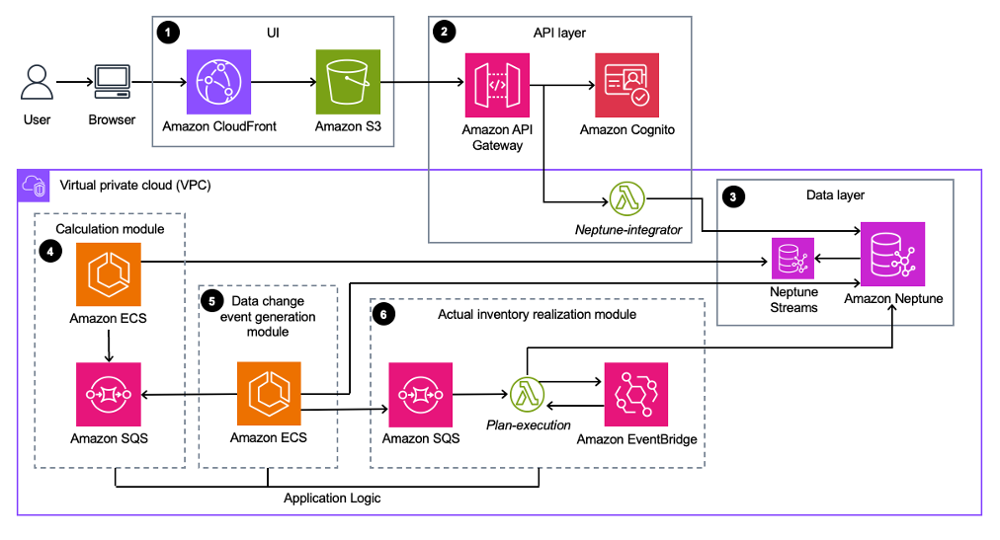
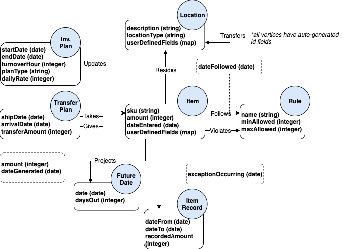

## Supply Chain Simulator on AWS

Supply Chain Simulator on AWS is a low-code solution that you can use to create a digital replica of your physical supply chain. With this digital replica, you can evaluate alternate network configurations and operational strategies to optimize your supply chains. For example, you can use this solution’s models to help you evaluate how disruptions in your network impact order fill rates and supply chain costs. You can also model changes in demand forecasts, facility closures, labor or machine capacity constraints, and relative costs of different modes of transport. 

This solution deploys an AWS CloudFormation template that provides an application for facilitating the supply chain use cases described above.

## On this page

-   [Architecture Overview](#architecture-overview)
-   [Deployment](#deployment)
-   [Source Code](#source-code)
-   [Creating a custom build](#creating-a-custom-build)

## Architecture overview

Numbers correspond to what's shown on the architecture diagram below.

1.	Amazon CloudFront caches and delivers a single-page application built in React hosted as a static website in an Amazon Simple Storage Service (Amazon S3) bucket.

2.	A REST API Gateway integrates with Amazon Cognito and then passes along authenticated requests to an AWS Lambda function. The Lambda function handles basic create, read, update, delete (CRUD) use cases for most of the data model. 

3.	An Amazon Neptune database hosted in a private subnet serves as the sole database technology of the solution. Neptune Streams provide a sequential record of changes for backend processes.

4.	A Node JS container hosted on Amazon Elastic Container Service (Amazon ECS) on AWS Fargate, which pulls messages coming from data changes that cause a calculation of supply chain projections. It will leverage Amazon Simple Queue Service (Amazon SQS) for exponential backoffs in case of database failures.

5.	A Node JS container hosted on Amazon ECS on AWS Fargate periodically polls Neptune streams and routes relevant data changes to pre-configured backend query destinations.

6.	Relevant plan changes invoke a Lambda function that manages a list of schedules in Amazon EventBridge to run inventory changes.



The following is a vertex model of the graph database (shown in number 3 in the previous diagram).



## Deployment

There are 2 options for deployment into an AWS account: using `cdk deploy` or using Amazon CloudFormation templates.

### 1. Using `cdk deploy`

The following are pre-requisites to build and deploy locally:

* [Nodejs 18.x](https://nodejs.org/en)

* [CDK v2.74.0](https://github.com/aws/aws-cdk)

**Note: Configure the AWS CLI with your AWS credentials or have them exported in the CLI terminal environment. If the credentials are invalid or expired, running `cdk deploy` produces an error.

After cloning the repo from GitHub, follow these steps:

```
  cd <project-directory>/source/infrastructure
  npm install
  npm run build
  cdk deploy
```

### 2. Using Amazon CloudFormation templates

To deploy Amazon CloudFormation templates, follow the instruction for [creating a custom build](#creating-a-custom-build).

## Source code

### Project directory structure

```
├──api
|   └──neptune-integrator                           [API logic]
│       ├── api
│       ├── node_modules
│       ├── package-lock.json
│       ├── package.json
│       ├── model
│       ├── tests
│       ├── .eslintignore
│       ├── .eslintrc.json
│       ├── .npmrc
│       ├── .prettierrc.json
│       ├── index.ts
│       ├── jest.config.js
│       └── tsconfig.json
├──app
|   ├──plan-execution                               [Generates EventBridge schedules]
│   |    ├── src
│   |    ├── test
│   |    ├── package-lock.json
│   |    ├── package.json
│   |    ├── test
│   |    ├── .eslintignore
│   |    ├── .eslintrc.json
│   |    ├── .npmrc
│   |    ├── .prettierrc.json
│   |    ├── index.ts
│   |    ├── jest.config.js
│   |    ├── README.md
│   |    └── tsconfig.json
|   ├──supply-chain-simulator-calculation           [Generates calculated projections]
│   |    ├── src
│   |    ├── test
│   |    ├── package-lock.json
│   |    ├── package.json
│   |    ├── test
│   |    ├── .eslintignore
│   |    ├── .eslintrc.json
│   |    ├── .npmrc
│   |    ├── .prettierrc.json
│   |    ├── index.ts
│   |    ├── jest.config.js
│   |    ├── README.md
│   |    ├── Dockerfile
│   |    ├── prep-build.sh
│   |    ├── reset-after-build.sh
│   |    └── tsconfig.json
|   └──supply-chain-simulator-event-generation      [Generates data change events for backend]
│       ├── src
│       ├── test
│       ├── package-lock.json
│       ├── package.json
│       ├── test
│       ├── .eslintignore
│       ├── .eslintrc.json
│       ├── .npmrc
│       ├── .prettierrc.json
│       ├── index.ts
│       ├── jest.config.js
│       ├── README.md
│       ├── Dockerfile
│       ├── prep-build.sh
│       ├── reset-after-build.sh
│       └── tsconfig.json
├── infrastructure                                  [CDK infrastructure]
│   ├── bin
│   ├── cdk.json
│   ├── cdk.out
│   ├── coverage
│   ├── jest.config.js
│   ├── lib
│   ├── node_modules
│   ├── package-lock.json
│   ├── package.json
│   ├── test
│   ├── .eslintignore
│   ├── .eslintrc.js
│   └── tsconfig.json
├── shared                                          [Shared code across solution]
│   ├── api
│   |    ├── api-interface.ts
│   |    ├── api-response.ts
│   |    ├── apiMetrics.ts
│   |    ├── validation.ts
│   |    ├── package-lock.json
│   |    ├── package.json
│   |    ├── .npmrc
│   |    └── tsconfig.json
│   ├── neptune
│   |    ├── db
│   |    ├── model
│   |    ├── test
│   |    ├── util
│   |    ├── package-lock.json
│   |    ├── package.json
│   |    ├── .npmrc
│   |    └── tsconfig.json
│   └── util
│       ├── logger.ts
│       ├── pathParser.ts
│       ├── package-lock.json
│       ├── package.json
│       ├── .npmrc
│       └── tsconfig.json
├── website                                          [UI app]
│   ├── public
│   ├── src
│   ├── tests
│   ├── validation.ts
│   ├── package-lock.json
│   ├── package.json
│   ├── .npmrc
│   ├── node_modules
│   ├── package-lock.json
│   ├── package.json
│   ├── test
│   ├── .eslintignore
│   ├── .eslintrc.js
│   ├── .prettierrc.json
│   └── tsconfig.json
```

## Creating a custom build

### Prerequisites for customization

* [Node.js](https://nodejs.org/en/) 18.x

### 1. Clone the repository

```bash
git clone https://github.com/aws-solutions/supply-chain-simulator-on-aws.git
cd supply-chain-simulator-on-aws
export MAIN_DIRECTORY=$PWD
```

### 2. Declare environment variables

```bash
export DIST_BUCKET_PREFIX=my-bucket-prefix # S3 bucket name prefix
export SOLUTION_NAME=my-solution-name
export VERSION=my-version # version number for the customized code
export REGION=aws-region-code # the AWS region to test the solution (e.g. us-east-1)
```

**Note: When you define `DIST_BUCKET_PREFIX`, a randomized value is recommended. You will need to create an S3 bucket where the name is `<DIST_BUCKET_PREFIX>-<REGION>`. The solution's CloudFormation template will expect the source code to be located in a bucket matching that name.**

### Unit test

After making changes, run unit tests to ensure that the added customization passes the tests:

```bash
cd $MAIN_DIRECTORY/deployment
chmod +x run-all-tests.sh
./run-all-tests.sh
```

### Build

```bash
cd $MAIN_DIRECTORY/deployment
chmod +x build-s3-dist.sh
./build-s3-dist.sh $DIST_BUCKET_PREFIX $SOLUTION_NAME $VERSION $REGION
```

### Build the UI

For development: 

1. In the source\website directory you can run:
`npm start`
This runs the app in the development mode.

2. Open [http://localhost:3000](http://localhost:3000) to view it in the browser.
The page will reload if you make edits. You will also see any lint errors in the console.

To run the jest test cases:
`npm test`

To build the web UI for production:
`npm run build`

### Deploy the CloudFormation template

1. Before deploying the solution, create an Amazon EC2 keypair instance manually, used as parameter for deployment.
2. Deploy the distributable to the Amazon S3 bucket in your account. Ensure that you are uploading all files and directories under `deployment/global-s3-assets` and `deployment/regional-s3-assets` to `<SOLUTION_NAME>/<VERSION>` folder in the `<DIST_BUCKET_PREFIX>-<REGION>` bucket (e.g. `s3://<DIST_BUCKET_PREFIX>-<REGION>/<SOLUTION_NAME>/<VERSION>/`).
3. Get the link of the solution template uploaded to your Amazon S3 bucket.
4. Deploy the solution to your account by launching a new CloudFormation stack using the link of the solution template in Amazon S3.

CLI-based CloudFormation deployment:

```bash

aws cloudformation create-stack \
   --profile ${AWS_PROFILE:-default} \
   --region ${REGION} \
   --template-url https://${DIST_BUCKET_PREFIX}-${REGION}.s3.amazonaws.com/${SOLUTION_NAME}/${VERSION}/supply-chain-simulator-on-aws.template \
   --stack-name supply-chain-simulator-on-aws \
   --capabilities CAPABILITY_IAM CAPABILITY_NAMED_IAM CAPABILITY_AUTO_EXPAND \
   --parameters \
        ParameterKey=StreamPollerImageParam,ParameterValue=(my account num).dkr.ecr.us-east-1.amazonaws.com/supply-chain-simulator-on-aws:streampoller \
        ParameterKey=CalculationServiceImageParam,ParameterValue=(my account num).dkr.ecr.us-east-1.amazonaws.com/supply-chain-simulator-on-aws:calculationservice \
        ParameterKey=AdminEmail,ParameterValue=${ADMIN_EMAIL}
```

CLI-based CloudFormation update:

```
aws cloudformation update-stack \
   --profile ${AWS_PROFILE:-default} \
   --region ${REGION} \
   --template-url https://${DIST_BUCKET_PREFIX}-${REGION}.s3.amazonaws.com/${SOLUTION_NAME}/${VERSION}/supply-chain-simulator-on-aws.template \
   --stack-name supply-chain-simulator-on-aws \
   --capabilities CAPABILITY_IAM CAPABILITY_NAMED_IAM CAPABILITY_AUTO_EXPAND \
   --parameters ParameterKey=StreamPollerImageParam,ParameterValue=(my account num).dkr.ecr.us-east-1.amazonaws.com/supply-chain-simulator-on-aws:streampoller \
        ParameterKey=CalculationServiceImageParam,ParameterValue=(my account num).dkr.ecr.us-east-1.amazonaws.com/supply-chain-simulator-on-aws:calculationservice \
        ParameterKey=AdminEmail,ParameterValue=${ADMIN_EMAIL}

```

## Collection of operational metrics

This solution collects anonymous operational metrics to help AWS improve the quality and features of the solution. For more information, including how to disable this capability, please see the
[implementation guide](./implementation-guide/IMPLEMENTATION_GUIDE.md).

---

Copyright Amazon.com, Inc. or its affiliates. All Rights Reserved.

Licensed under the Apache License, Version 2.0 (the "License");
you may not use this file except in compliance with the License.
You may obtain a copy of the License at

    http://www.apache.org/licenses/LICENSE-2.0

Unless required by applicable law or agreed to in writing, software
distributed under the License is distributed on an "AS IS" BASIS,
WITHOUT WARRANTIES OR CONDITIONS OF ANY KIND, either express or implied.
See the License for the specific language governing permissions and
limitations under the License.
