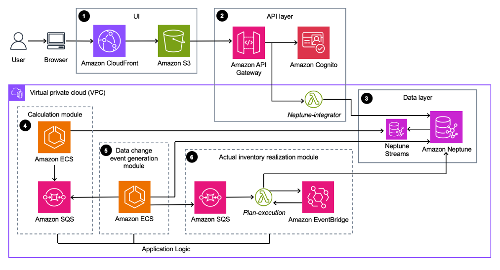
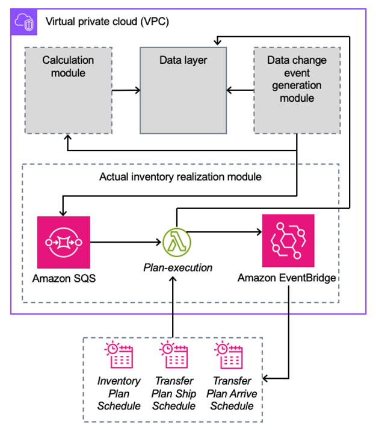
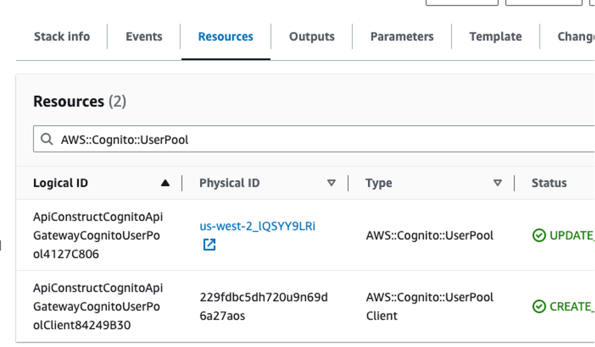
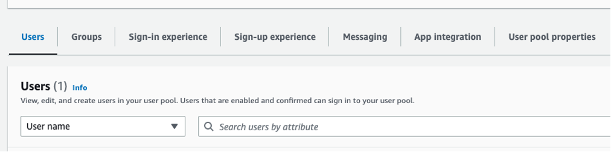
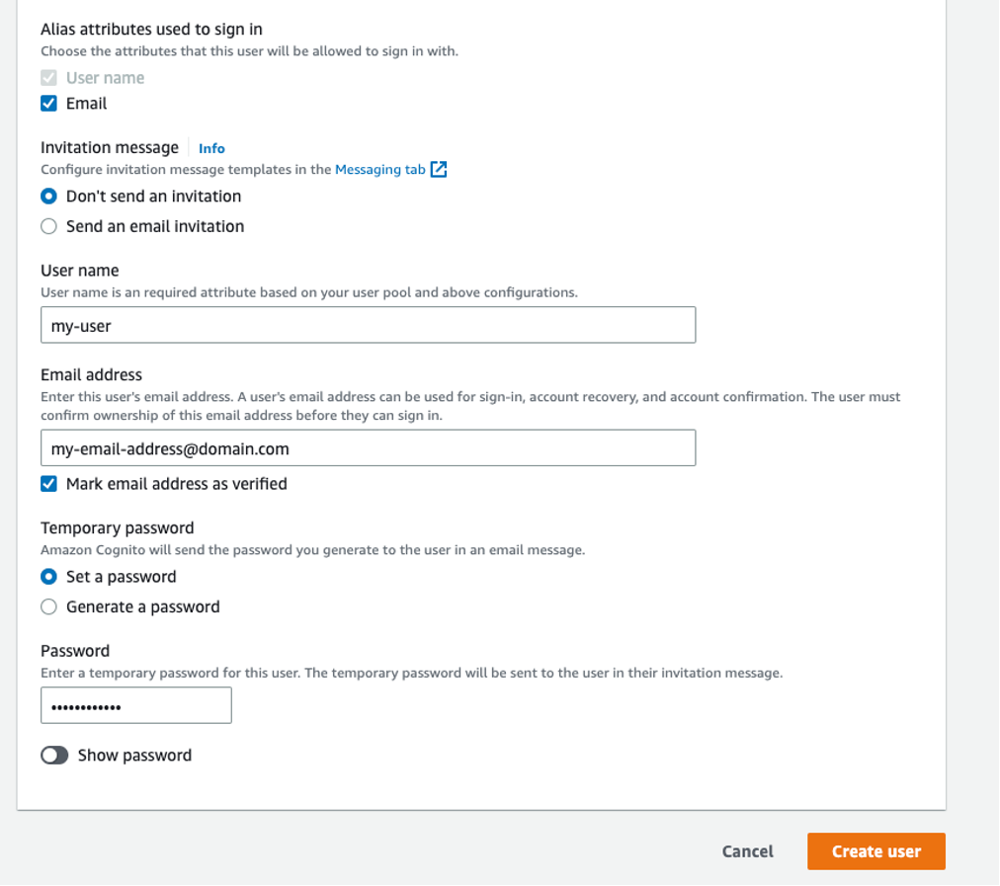
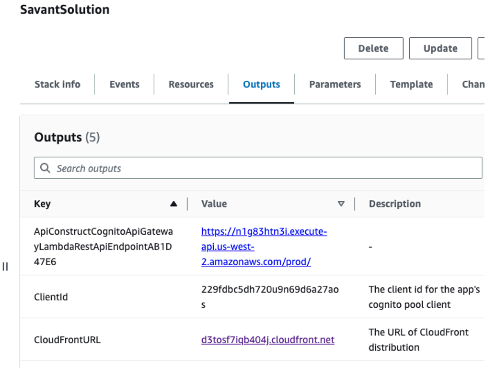
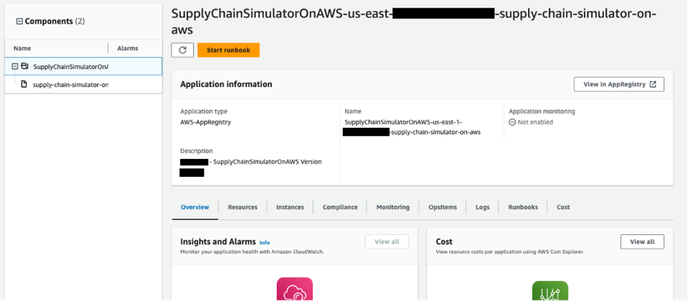
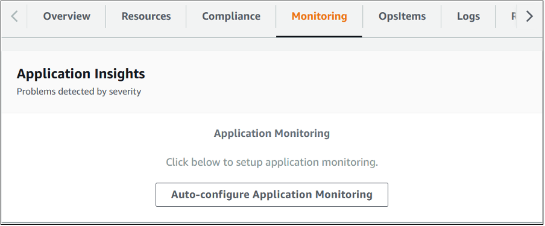
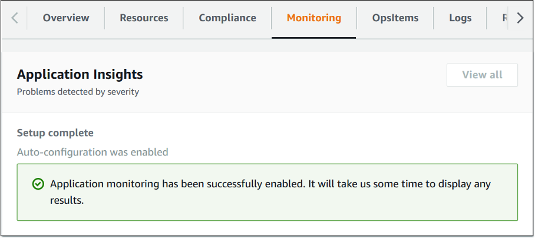

**Supply Chain Simulator on AWS**

Implementation Guide

*July 2023*

Supply Chain Simulator on AWS is licensed under the terms of the Apache
License Version 2.0 available at
[The Apache Software
Foundation](https://www.apache.org/licenses/LICENSE-2.0).

# Contents 

[Overview](#overview)

[Architecture overview](#architecture-overview)

[Architecture details](#architecture-details)

[Plan your deployment](#plan-your-deployment)

[Deploy the solution](#deploy-the-solution)

[Monitoring the solution with AWS Service Catalog AppRegistry](#monitoring-the-solution-with-aws-service-catalog-appregistry)

[Troubleshooting](#troubleshooting)

[Uninstall the solution](#uninstall-the-solution)

[Developer guide](#developer-guide)

[Reference](#reference)

[Revisions](#revisions)

[Notices](#notices)

# Overview

Supply Chain Simulator on AWS is a low-code solution that you can use to create a digital replica of your physical supply chain. With this digital replica, you can evaluate alternate network configurations and operational strategies to optimize your supply chains. For example, you can use this solution's models to help you evaluate how disruptions in your network impact order fill rates and supply chain costs. You can also model changes in demand forecasts, facility closures, labor or machine capacity constraints, and relative costs of different modes of transport.

This solution's data model brings together data from disparate sources like enterprise resource planning (ERP) systems, manufacturing execution systems (MESs), logistics systems, and other data lakes. You can use the output from this solution to build supply chain systems for day-to-day operations, including the recently-launched AWS Supply Chain application. This solution's simulation features include demand and supply propagation from node to node, end-to-end visibility of inventory flows (from manufacturer to consumer), and projection of on-time customer deliveries.

This implementation guide provides an overview of the Supply Chain Simulator on AWS solution, its reference architecture and components, considerations for planning the deployment, configuration steps for deploying the solution to the Amazon Web Services (AWS) Cloud. 

This guide is intended for solution architects, business decision makers, DevOps engineers, data scientists, and cloud professionals who want to implement the Supply Chain Simulator on AWS solution in their environment.

Use this navigation list to quickly find the following information:

* Know the [cost](#cost) for running this solution. The estimated cost for running this solution in the US East (N. Virginia) Region is USD $252.95 per month.
* Understand the [security](#security) considerations for this solution.
* Know how to plan for [quotas](#quotas) for this solution.
* Know which [AWS Regions](#supported-aws-regions) are supported for this solution.
* View or download the [AWS CloudFormation template](#aws-cloudformation-template) included in this solution to automatically deploy the infrastructure resources (the "stack") for this solution.

## Features and benefits

The Supply Chain Simulator on AWS solution provides the following features:

**Modeling**

Model a finished goods distribution network, including elements such as facilities, inventory, inventory levels, routes, and plans. You can create a distribution network model through the solution’s user interface or through provided application programming interfaces (APIs).

**Inventory projection**

Project your inventory for a rolling 30-day period. When you create a distribution network model within the solution, the solution projects inventory levels for each item at each location within the network. As days pass, the solution generates new inventory projections for dates that fall within the 30-day projection window. If you modify the model, including adjusting inventory levels or changing the distribution network, the solution automatically recalculates projections to reflect the new state of the model.

**Customization**

Customize the data model for the item and location entities. This feature is useful for adding business or industry specific fields for which unique values can be set on individual items and locations. 

**Integration with AWS Service Catalog AppRegistry and AWS Systems
Manager Application Manager**

This solution includes an [AWS Service Catalog AppRegistry](https://docs.aws.amazon.com/servicecatalog/latest/arguide/intro-app-registry.html) resource to register the solution's CloudFormation template and its underlying resources as an application in both AppRegistry and [AWS Systems Manager Application Manager](https://docs.aws.amazon.com/systems-manager/latest/userguide/application-manager.html). With this integration, you can centrally manage the solution's resources.

## Use cases

**Inventory planning**

Distribution managers and supply chain planners can use Supply Chain Simulator on AWS to anticipate supply shortages and logistical bottlenecks. This provides visibility into both inventory management and lead time impact of network configurations and sourcing decisions.

**Simulation**

Distribution managers can use the digital distribution network model within Supply Chain Simulator on AWS to experiment with alternate network designs and view their effects on inventory levels. Supply chain planners can simulate the effect of disruptions or unexpected changes to the product flow to better understand and anticipate risks to their business.

## Concepts and definitions

This section describes key concepts and defines terminology specific to this solution:

**Location**

A facility within the distribution network. A location may be one of three types: a manufacturer, a distributor, or a seller.

**Item**

A physical product that can be manufactured, transferred, and sold within the distribution network. An item is defined by a stock-keeping unit (SKU) and a description.

**Inventory plan**

Inventory plans define a schedule for how many of a specific item are expected to be manufactured or sold at either a manufacturer location or a seller location, respectively. An inventory plan consists of the item being manufactured or sold, the quantity manufactured or sold per plan, and the date for the plan.

**Transfer plan**

Transfer plans define the movement of inventory between locations. A transfer plan consists of the item being transferred, the quantity being transferred, the source and destination locations, and the expected departure and arrival dates. 

**Inventory projection**

Inventory projections are automatically generated by the solution and indicate the expected inventory levels for each item, at each location, for each day between the current day and 30 days in the future. Inventory projections consist of the following fields:

* **In-transit**
The quantity of the item currently in-transit to the selected location.

* **Supply**
The quantity of the item delivered to the selected location.

* **Inventory (beginning-on-hand)**
The quantity of the item in inventory at the selected location at the beginning of the day.

* **Inventory (ending-on-hand)**
The quantity of the item in inventory at the selected location at the end of the day.

* **Demand**
The quantity of the item removed from the selected location.

For a general reference of AWS terms, see the [AWS glossary](https://docs.aws.amazon.com/general/latest/gr/glos-chap.html) in the *AWS General Reference*.

# Architecture overview

This section provides a reference implementation architecture diagram for the components deployed with this solution.

## Architecture diagram

Deploying this solution with the default parameters deploys the following components in your AWS account. 



***Supply Chain Simulator on AWS architecture***

**Note: AWS CloudFormation resources are created from AWS Cloud Development Kit (AWS CDK) constructs.**

The high-level process flow for the solution components deployed with the AWS CloudFormation template is as follows:

1.  [Amazon CloudFront](https://aws.amazon.com/cloudfront/) caches and delivers a single-page application built in React [hosted](https://aws.amazon.com/premiumsupport/knowledge-center/cloudfront-serve-static-website/) as a static website in an [Amazon Simple Storage Service](https://aws.amazon.com/s3/) (Amazon S3) bucket.

2.  A [REST API Gateway](https://docs.aws.amazon.com/apigateway/latest/developerguide/apigateway-rest-api.html) integrates with [Amazon Cognito](https://aws.amazon.com/cognito/) and then passes along authenticated requests to an [AWS Lambda](https://aws.amazon.com/lambda/) function. The Lambda function handles basic create, read, update, delete (CRUD) use cases for most of the data model.

3.  An [Amazon Neptune](https://aws.amazon.com/neptune/) database hosted in a private subnet serves as the sole database technology of the solution. [Neptune streams](https://docs.aws.amazon.com/neptune/latest/userguide/streams-using.html) provide a sequential record of changes for backend processes.

4.  A [Node JS](https://nodejs.org/en/) container hosted on [Amazon Elastic Container Service (Amazon ECS) on AWS Fargate](https://docs.aws.amazon.com/AmazonECS/latest/developerguide/AWS_Fargate.html), which pulls messages coming from data changes that cause a calculation of supply chain projections. It will leverage [Amazon Simple Queue Service](https://aws.amazon.com/sqs/) (Amazon SQS) for [exponential backoffs](https://docs.aws.amazon.com/sdkref/latest/guide/feature-retry-behavior.html) in case of database failures.

5.  A [Node JS](https://nodejs.org/en/) container hosted on Amazon ECS on AWS Fargate periodically polls [Neptune Streams](https://docs.aws.amazon.com/neptune/latest/userguide/streams-using.html) and routes relevant data changes to pre-configured backend query destinations.

6.  Relevant plan changes invoke a [Lambda](https://aws.amazon.com/lambda/) function that manages a list of schedules in [Amazon EventBridge](https://aws.amazon.com/eventbridge/) to run inventory changes.

## AWS Well-Architected design considerations

We designed this solution with best practices from the [AWS Well-Architected Framework](https://aws.amazon.com/architecture/well-architected/) which helps customers design and operate reliable, secure, efficient, and cost-effective workloads in the cloud.

This section describes how the design principles and best practices of the Well-Architected Framework were applied when building this solution.

### Operational excellence pillar

This section describes how we applied the principles and best practices of the [operational excellence pillar](https://docs.aws.amazon.com/wellarchitected/latest/operational-excellence-pillar/welcome.html) when designing this solution.

* This solution pushes metrics and logs to [Amazon CloudWatch](https://aws.amazon.com/cloudwatch/) to provide observability into the infrastructure from each Lambda function and each Amazon ECS on AWS Fargate container.

* We designed this solution with discrete pieces that you can upgrade individually.

* This solution is deployed by using CloudFormation, making it easier to rollback changes.

### Security pillar 

This section describes how we applied the principles and best practices of the [security pillar](https://docs.aws.amazon.com/wellarchitected/latest/security-pillar/welcome.html) when designing this solution.

* This solution's web client and API users are authenticated with Cognito.

* All inter-service communications use least-privileged [AWS Identity and Access Management](https://aws.amazon.com/iam/) (IAM) roles.

* The database is provisioned in a private subnet, inaccessible from anywhere except within the same subnet.

* End user and API Gateway use Bearer tokens generated and handled by Cognito.

* All data is encrypted at rest and in transit.

* All security groups only allow exactly what is required for the application to function.

### Reliability pillar

This section describes how we applied the principles and best practices of the [reliability pillar](https://docs.aws.amazon.com/wellarchitected/latest/reliability-pillar/welcome.html) when designing this solution.

* This solution leverages AWS serverless technologies wherever possible, including Lambda, API Gateway, Cognito, Amazon ECS on AWS Fargate, and Amazon SQS.

* You can manually update the Neptune database to [Amazon Neptune Serverless](https://docs.aws.amazon.com/neptune/latest/userguide/neptune-serverless.html).

* The calculation engine leverages exponential backoffs by retrying failed messages on an ever-increasing interval.

* Amazon ECS on AWS Fargate ensures that one container for each service is always running.

* The solution's Neptune database cluster is multi-Availability-Zone by default to increase availability.

* The stream polling architecture creates an event-driven architecture for backend business logic processes.

### Performance efficiency pillar

This section describes how we applied the principles and best practices of the [performance efficiency pillar](https://docs.aws.amazon.com/wellarchitected/latest/performance-efficiency-pillar/welcome.html) when designing this solution.

* This solution uses a serverless architecture wherever possible, which keeps compute cost to a minimum.

* You can manually update the Neptune database cluster to Amazon Neptune Serverless to further leverage serverless cost savings.

* You can manually turn off containers to save costs when no calculations need to happen.

### Cost optimization pillar

This section describes how we applied the principles and best practices of the [cost optimization pillar](https://docs.aws.amazon.com/wellarchitected/latest/cost-optimization-pillar/welcome.html) when designing this solution.

* The solution uses a serverless architecture wherever possible, which only charges customers for what they use.

* The default size of Neptune's database is a [db.t3.medium](https://docs.aws.amazon.com/neptune/latest/userguide/instance-types.html#instance-type-t3-t4g) instance class to minimize the cost of data. You can manually upgrade its size with little downtime by following the steps in [Modifying a Neptune DB Cluster Using the Console](https://docs.aws.amazon.com/neptune/latest/userguide/manage-console-modify.html).

### Sustainability pillar

This section describes how we applied the principles and best practices of the [sustainability pillar](https://docs.aws.amazon.com/wellarchitected/latest/sustainability-pillar/sustainability-pillar.html) when designing this solution.

* The solution uses managed and serverless services to minimize the environmental impact of the backend services.

# Architecture details

This section describes the components and AWS services that make up this solution and the architecture details on how these components work together.

## User interface (UI) web client

We built the frontend web client with React JS. This web client integrates with Cognito for sign-in functionality. You must create users manually in Cognito. You can set the password with the UI when the user first logs in. The web client interacts solely with API Gateway for executing CRUD operations against the data model. It’s hosted on an S3 bucket as a static website and is cached and delivered by CloudFront.

## API endpoints

API Gateway and Lambda host a set of API endpoints. API Gateway integrates with Cognito and a token to ensure that only authorized users gain access. API Gateway passes long authenticated requests to the `Neptune-integrator` Lambda function, which reads the path and method to determine what logic to run. Depending on the request, the `Neptune-integrator` Lambda function returns a response after making necessary updates or reads against the Neptune database.

## Data change event generation module

The data change event generation module, or the stream poller module, is the entry to the backend calculation system of the solution and is built on top of [Neptune Streams](https://docs.aws.amazon.com/neptune/latest/userguide/streams-using.html). This module performs the following workflow:

1. This module uses Amazon ECS to repeatedly query Neptune streams for changes to the data.

2. The module compares the messages in the stream to pre-configured set of routing rules to destinations. The module reads the `key` attribute in the record to determine where to route. This tells the module what property changed. The module ignores vertex label creations and any property that changed but isn’t written in the router's constructor code. 

3.  The module caches what `commit` number it last processed to reduce duplicate messages and to reduce processing overhead.

## Calculation module

The calculation module consists mainly of another Amazon ECS container and an Amazon SQS queue. This module performs the following workflow:

1.  The module [long-polls](https://docs.aws.amazon.com/AWSSimpleQueueService/latest/SQSDeveloperGuide/sqs-short-and-long-polling.html) the Amazon SQS queue for messages incoming from the data change event generation module. These messages consist of data changes that impact the projections for an inventory for a location on the supply chain. For example: direct changes of a SKU amount, changes to a SKU’s manufacturing or sales plans, or changes to a SKU’s transfer plans. 

2.  Since incoming messages can impact the same inventory node multiple times, the module's logic de-duplicates calculations on each run against single inventory nodes.

3.  The module retries failed messages up to 11 times, exponentially increasing the [`DelaySeconds`](https://docs.aws.amazon.com/AWSSimpleQueueService/latest/SQSDeveloperGuide/sqs-delay-queues.html) attribute to exponentially backoff reliability problems during operation.

## Actual inventory realization module

The actual inventory realization module is a backend module handles the realization of inventory and transfer plans. This module performs the following workflow:

1. The `Plan-execution` Lambda function registers timers for each new or recently updated plan based on its preferred timestamp. 

2. Once the pre-registered timer is invoked, the `Plan-execution` Lambda function invokes the module to add or subtract the amount value for each target item. 

3. The module generates a new item record to track historical data.

4. All of these CRUD operations propagate corresponding plan-change events to the Neptune database.



***Actual inventory realization module architecture***

## Pagination limitation

We designed certain API endpoints to return all stored data. As a result, when the data volume increases, some operations might require more time to run.

## AWS services in this solution

* [Amazon API Gateway](https://aws.amazon.com/api-gateway/) - **Core.** Hosts the REST API endpoints.
         
* [Amazon CloudFront](https://aws.amazon.com/cloudfront/) - **Core.** Caches and delivers the static website frontend of the solution.

* [Amazon Cognito](https://aws.amazon.com/cognito/) - **Core.** Provides federated user sign-in to the web client.

* [Amazon EC2](https://aws.amazon.com/ec2/) - **Core.** Hosts elastic IP addresses and the NAT Gateway necessary for backend processes.

* [Amazon ECS](https://aws.amazon.com/ecs/) - **Core.** Hosts the docker containers necessary for projection calculation and event generation on Neptune.

* [Amazon EventBridge](https://aws.amazon.com/eventbridge/) - **Core.** Handles turning over inventory amounts according to stored plans.

* [Amazon Neptune](https://aws.amazon.com/neptune/) - **Core.** Stores data generated within the solution.

* [Amazon S3](https://aws.amazon.com/s3/) - **Core.** Hosts the static website content.

* [Amazon SQS](https://aws.amazon.com/sqs/) - **Core.** Connects backend processes to data changes.

* [AWS Lambda](https://aws.amazon.com/lambda/) - **Core.** Hosts the API logic and the actual inventory realization logic.

* [Amazon CloudWatch](https://aws.amazon.com/cloudwatch/) - **Supporting.** Stores logs from all compute processes.
 
* [AWS CloudTrail](https://aws.amazon.com/cloudtrail/) - **Supporting.** Logs access to the website and other actions.

* [AWS KMS](https://aws.amazon.com/kms/) - **Supporting.** Provides AWS managed keys for encrypting data.

* [AWS Systems Manager](http://aws.amazon.com/systems-manager/) - **Supporting.** Provides application-level resource monitoring and visualization of resource operations and cost data.

# Plan your deployment

This section describes the cost, security, Regions, and other considerations prior to deploying the solution.

## Cost 

You are responsible for the cost of the AWS services used while running this solution. As of this revision, the cost for running this solution with the default settings in the US East (N. Virginia) is approximately **$0.89 an hour**.

See the pricing webpage for each AWS service used in this solution.

We recommend creating a [budget](https://docs.aws.amazon.com/cost-management/latest/userguide/budgets-create.html) through [AWS Cost Explorer](http://aws.amazon.com/aws-cost-management/aws-cost-explorer/) to help manage costs. Prices are subject to change. For full details, see the pricing webpage for each AWS service used in this solution.

### Sample cost

The following list provides a sample cost breakdown for deploying this solution with the default parameters in the US East (N. Virginia) Region for one month.

* Amazon EC2 - Other (2 Elastic IPs, 1 NAT Gateway) - **$67.26** 

* Amazon ECS (2 Fargate containers) - **$36.75**

* Amazon Neptune (2 t3.medium databases - default deployment) - **$521.74**
                                                
* Amazon CloudWatch (Logs for 2 Lambda functions and 2 ECS services) - **$15.85**
                                               
* Amazon SQS (~10,000 messages) - **$2.39**

* Amazon Cognito (1 user pool, 1 app client) - **$1.25**

* AWS KMS (1 AWS-managed encryption key) - **$0.94**

* Amazon S3 (1 static website with 15 users) - **$0.33**

* Amazon EventBridge (\<100 EventBridge schedules) - **$0.00**

* Amazon VPC (1 VPC) - **$14.86**

 **Total** - **$661.37**

## Security

When you build systems on AWS infrastructure, security responsibilities are shared between you and AWS. This [shared responsibility model](https://aws.amazon.com/compliance/shared-responsibility-model/) reduces your operational burden because AWS operates, manages, and controls the components including the host operating system, the virtualization layer, and the physical security of the facilities in which the services operate. For more information about AWS security, visit [AWS Cloud Security](http://aws.amazon.com/security/).

**Important: This solution isn't designed to handle personal identifiable information (PII). See [PII data](#pii-data) for more information.**

**Note: This solution's default configuration isn't designed to support Transport Layer Security (TLS) v1.2 or supply distributed denial-of-service (DDoS) protection. See [API Gateway TLS v1.2](#api-gateway-tls-v1.2) and [AWS WAF](#aws-waf) for more information on how to manually implement these security components.**

### IAM roles

IAM roles allow customers to assign granular access policies and permissions to services and users on the AWS Cloud. This solution creates IAM roles that grant the solution's Lambda functions access to the Neptune database, Amazon SQS queues, and AWS Key Management Service (AWS KMS) encryption keys. It also creates IAM roles for similar purposes for Amazon ECS containers.

### Amazon CloudFront

This solution deploys a web console [hosted](https://docs.aws.amazon.com/AmazonS3/latest/dev/WebsiteHosting.html) in an S3 bucket. To help reduce latency and improve security, this solution includes a CloudFront distribution with an origin access identity, which is a CloudFront user that provides public access to the solution's website bucket contents. For more information, see [Restricting Access to Amazon S3 Content by Using an Origin Access Identity](https://docs.aws.amazon.com/AmazonCloudFront/latest/DeveloperGuide/private-content-restricting-access-to-s3.html) in the *Amazon CloudFront Developer Guide*.

### Security groups

The security groups created in this solution are designed to control and isolate network traffic between the Lambda functions, Amazon ECS containers, and the Neptune database. The data resides in a private subnet and can only be accessed with the `Neptune-integrator` Lambda function, `Plan-execution` Lambda function, or Amazon ECS containers (backend processes).

### API Gateway TLS v1.2

If you want to use TLS v1.2 with the REST API endpoint provided by this solution, you must deploy a [custom domain](https://docs.aws.amazon.com/apigateway/latest/developerguide/how-to-custom-domains.html). Because the solution doesn't support this function by default, you must follow additional steps to secure the desired version of the TLS protocol. See [Choosing a minimum TLS version for a custom domain in API Gateway](https://docs.aws.amazon.com/apigateway/latest/developerguide/apigateway-custom-domain-tls-version.html) for instructions.

### PII data

This solution isn't designed with the advanced security protocols necessary to store, process, or handle PII. All data is encrypted in-transit and at rest; however, this solution doesn't vet or filter incoming data for PII elements. As a result, you have the responsibility for ensuring that no PII is included in the data transmitted.

### Custom AWS KMS keys

This solution uses encryption at rest for securing data and employs AWS-managed keys by default. These AWS-managed keys are used to automatically and transparently encrypt your data before it's written to the storage layer. Some users may prefer to have more control over their data encryption processes. This solution provides the option for users to substitute AWS-managed keys with customer-managed keys. This approach allows you to administer your own security credentials, offering a greater level of control and visibility. See [Encrypting Neptune Resources at Rest](https://docs.aws.amazon.com/neptune/latest/userguide/encrypt.html) for instructions on how to use customer-managed keys for encryption at rest with Neptune.

### AWS WAF

This solution's default configuration doesn't deploy a web application firewall (WAF) in front of the API. To enhance your API security by setting up a WAF, you must do so manually. AWS provides an in-depth guide on how you can control access to your API Gateway with AWS WAF. See [Using AWS WAF to protect your APIs](https://docs.aws.amazon.com/apigateway/latest/developerguide/apigateway-control-access-aws-waf.html) for instructions on how to implement AWS WAF in front of your API and increase DDoS protection for your web applications.

### Monitoring and alarms

We designed this solution with built-in monitoring for Lambda, Amazon ECS, and Neptune. By default, these monitoring services are accessible within the AWS Management Console, in the console for each individual service. To create customized CloudWatch alarms for more specialized tracking and alerting, see [Create a CloudWatch alarm based on a static threshold](https://docs.aws.amazon.com/AmazonCloudWatch/latest/monitoring/ConsoleAlarms.html).

## Supported AWS Regions

This solution uses the Neptune and Amazon ECS on AWS Fargate services, which are not currently available in all AWS Regions. You must launch this solution in an AWS Region where they are available. For the most current availability of AWS services by Region, see the [AWS Regional Services List](https://aws.amazon.com/about-aws/global-infrastructure/regional-product-services/).

This solution is supported in the following AWS Regions:

* US East (Ohio)

* US East (N. Virginia)

* US West (Northern California)

* US West (Oregon)

* Africa (Cape Town)

* Asia Pacific (Hong Kong)

* Asia Pacific (Mumbai)

* Asia Pacific (Seoul) 

* Asia Pacific (Singapore)

* Asia Pacific (Sydney) 

* Asia Pacific (Tokyo)

* Canada (Central)                    

* China (Beijing)

* China (Ningxia)

* Europe (Frankfurt)

* Europe (Ireland)

* Europe (London)

* Europe (Paris)

* Europe (Stockholm)

* Middle East (Bahrain)

* South America (São Paulo)

* AWS GovCloud (US-East)

* AWS GovCloud (US-West)                 

## Quotas

Service quotas, also referred to as limits, are the maximum number of service resources or operations for your AWS account. Make sure you have sufficient quota for each of the [services implemented in this solution](#_AWS_services_in). For more information, see [AWS service quotas](https://docs.aws.amazon.com/general/latest/gr/aws_service_limits.html).

Use the following links to go to the page for that service. To view the service quotas for all AWS services in the documentation without switching pages, view the information in the [Service endpoints and quotas](https://docs.aws.amazon.com/general/latest/gr/aws-general.pdf#aws-service-information) page in the PDF instead.

### AWS CloudFormation quotas

Your AWS account has CloudFormation quotas that you should be aware of when [launching the stack](#step-1-choose-your-deployment-option) in this solution. By understanding these quotas, you can avoid limitation errors that would prevent you from deploying this solution successfully. For more information, see [AWS CloudFormation quotas](https://docs.aws.amazon.com/AWSCloudFormation/latest/UserGuide/cloudformation-limits.html) in the *AWS CloudFormation User's Guide*.

# Deploy the solution

This solution uses [CloudFormation templates and stacks](https://docs.aws.amazon.com/AWSCloudFormation/latest/UserGuide/cfn-whatis-concepts.html) to automate its deployment. The CloudFormation template describes the AWS resources included in this solution and their properties. The CloudFormation stack provisions the resources that are described in the template.

## Deployment process overview

Follow the step-by-step instructions in this section to configure and deploy the solution into your account.

Before you launch the solution, review the cost, architecture, security, and other considerations discussed in this guide. Follow the step-by-step instructions in this section to configure and deploy the solution into your account.

**Time to deploy:** Approximately 30-45 minutes

[Step 1: Choose your deployment option](#step-1-choose-your-deployment-option)

[Step 2: Launch the stack](#step-2-launch-the-stack)

[Step 3: Set up a Cognito user](#step-3-set-up-a-cognito-user)

[Step 4: Sign in to the UI web client](#step-4-sign-in-to-the-ui-web-client)

## Step 1: Choose your deployment option

Decide between a *development* environment, which will automatically delete most solution components when you uninstall the solution, or a *production* environment, which requires you to first delete the solution components when you uninstall the solution.

## Step 2: Launch the stack

Follow the step-by-step instructions in this section to configure and deploy the solution into your account.

**Time to deploy:** Approximately 15 minutes

1.  Sign in to the [AWS Management Console](https://aws.amazon.com/console/) and [launch]() the `supply-chain-simulator-on-aws.template` CloudFormation template.

2.  The template launches in the US East (N. Virginia) Region by default. To launch the solution in a different AWS Region, use the Region selector in the console navigation bar.

**Note: This solution uses the Neptune and Amazon ECS on AWS Fargate services, which are not currently available in all AWS Regions. You must launch this solution in an AWS Region where they are available. For the most current availability of AWS services by Region, see the [AWS Regional Services List](https://aws.amazon.com/about-aws/global-infrastructure/regional-product-services/).**

3.  On the **Create stack** page, verify that the correct template URL is in the **Amazon S3 URL** text box and choose **Next**.

4.  On the **Specify stack details** page, assign a name to your solution stack. For information about naming character limitations, see [IAM and AWS STS quotas](https://docs.aws.amazon.com/IAM/latest/UserGuide/reference_iam-limits.html) in the *AWS Identity and Access Management User Guide*.

5.  Under **Parameters**, review the parameters for this solution template and modify them as necessary. This solution uses the following default values.

    * **Stack name** - `<Requires input>` - Name for the stack.

    * **AdminEmail** - `<Requires input>` - Admin email for a default user for the solution.

    * **Environment** - `dev` - Change to `prod` if you want to do the following:

       * Deploy a larger database ([`db.r5.large`](https://docs.aws.amazon.com/neptune/latest/userguide/instance-types.html#instance-type-r5)) than the default  for dev ([`db.t3.medium`](https://docs.aws.amazon.com/neptune/latest/userguide/instance-types.html#instance-type-t3-t4g)).

       * Retain your data when you uninstall the solution.

    * **ShouldSendAnonymizedMetrics** - `true` - Change to `false` if you don't want to send anonymized metrics. See [Anonymized datacollection](#anonymized-data-collection) for more information.  |

6.  Choose **Next**.

7.  On the **Configure stack options** page, choose **Next**.

8.  On the **Review** page, review and confirm the settings. Select the box acknowledging that the template creates IAM resources.

9.  Choose **Create stack** to deploy the stack.

You can view the status of the stack in the AWS CloudFormation console in the **Status** column. You should receive a CREATE_COMPLETE status in approximately 15 minutes.

**Note: In addition to the primary Lambda functions, `Neptune-integrator` and `Plan-execution`, this solution includes the `solution-helper` Lambda function, which runs only during initial configuration or when resources are updated or deleted. When you run this solution, all three Lambda functions appear in the AWS Management Console. Only the `Neptune-integrator` and `Plan-execution` functions are regularly active.**

## Step 3: Set up a Cognito user

Follow the step-by-step instructions in this section to set up a Cognito user.

1.  After the stack shows a CREATE_COMPLETE status, sign in to the [AWS CloudFormation console](https://console.aws.amazon.com/cloudformation).

2. Select **Stacks** from the navigation menu, and select the stack you deployed for this solution.

3. Choose the **Resources** tab.

4. Find the resource with the type `AWS::Cognito::UserPool` and select the corresponding link to navigate to the solution's user pool.



5. Choose the **Users** tab. You should see an empty list of users.



6. Choose **Create user**.

7. Under **User information**, complete the following steps:

    a.  For **Alias attributes used to sign in**, select the **Email** box.

    b.  For **Invitation message**, leave the default selection of **Don't send an invitation**.

    c.  For **User name**, enter a user name.

    d.  For **Email address**, enter an email address associated with the user. Select the **Mark email address as verified** box.

    e.  For **Temporary password**, set a temporary password.

    f.  Choose **Create user**.

***Note:** You must follow all of these steps to be able to log in to the solution dashboard.*



## Step 4: Sign in to the UI web client

1.  Sign in to the [AWS CloudFormation console](https://console.aws.amazon.com/cloudformation).

2.  Select **Stacks** from the navigation menu, and select the stack you deployed for this solution.

3.  Choose the **Outputs** tab.

4. Find the output called `CloudFrontURL` and select the corresponding link to open the solution's web client.

5. Sign in with the user you created in [step 3](#step-3-set-up-a-cognito-user).

6. When prompted, reset your password.



## AWS CloudFormation template

You can download the CloudFormation template for this solution before deploying it.

[supply-chain-simulator-on-aws.template](https://solutions-reference.s3.amazonaws.com/SupplyChainSimulatorOnAWS/latest/supply-chain-simulator-on-aws.template) - Use this template to launch the solution and all associated components. The default configuration deploys Lambda, Amazon ECS, Neptune, CloudWatch, Amazon SQS, Cognito, AWS KMS, Amazon S3, EventBridge, [AWS CloudTrail](https://aws.amazon.com/cloudtrail/), Lambda, API Gateway, CloudFront, and [Amazon Simple Notification Service](https://aws.amazon.com/sns) (Amazon SNS). You can customize the template to meet your specific needs.

**Note: CloudFormation resources are created from [AWS Cloud Development Kit](https://aws.amazon.com/cdk) (AWS CDK) constructs.**

This AWS CloudFormation template deploys the solution in the AWS Cloud. You must meet the following prerequisites before launching the stack:

1.  An AWS account in which you have access to deploy CloudFormation stacks.

2.  An email to use as the admin email for the solution.

Before you launch the solution, review the [cost](#cost), [architecture](#architecture-overview), [network security](#security), and other considerations discussed earlier in this guide.

**Important: This solution includes an option to send anonymized operational metrics to AWS. We use this data to better understand how customers use this solution and related services and products. AWS owns the data gathered though this survey. Data collection is subject to the [AWS Privacy Notice](https://aws.amazon.com/privacy/). To opt out of this feature, download the template, modify the CloudFormation mapping section, and then use the AWS CloudFormation console to upload your updated template and deploy the solution. For more information, see the [Anonymized data collection](#anonymized-data-collection) section of this guide.**

# Monitoring the solution with AWS Service Catalog AppRegistry

This solution includes an AppRegistry resource to register the CloudFormation template and underlying resources as an application in both AppRegistry and Application Manager. Application Manager gives you an application-level view into this solution and its resources so that you can:

*  Monitor its resources, costs for the deployed resources across stacks and AWS accounts, and logs associated with this solution from a central location.

*  View operations data for the resources of this solution in the context of an application. For example, deployment status, CloudWatch alarms, resource configurations, and operational issues.

The following figure depicts an example of the application view for this
solution stack in Application Manager.



***Supply Chain Simulator on AWS stack in Application Manager***

**Note: You must activate CloudWatch Application Insights, AWS Cost Explorer, and cost allocation tags associated with this solution. They are not activated by default.**

## Activate CloudWatch Application Insights

1.  Sign in to the [Systems Manager console](https://console.aws.amazon.com/systems-manager/appmanager).

2.  In the navigation pane, choose **Application Manager**.

3.  In **Applications**, choose **AppRegistry applications**.

4.  In **AppRegistry applications**, search for the application name for this solution and select it.

The next time you open Application Manager, you can find the new application for your solution in the **AppRegistry application** category.

5.  In the **Components** tree, choose the application stack you want to activate.

6.  In the **Monitoring** tab, in **Application Insights**, select **Auto-configure Application Monitoring**.



Monitoring for your applications is now activated and the following
status box appears:



## Activate AWS Cost Explorer

You can see the overview of the costs associated with the application and application components within the Application Manager console through integration with AWS Cost Explorer which must be first activated. Cost Explorer helps you manage costs by providing a view of your AWS resource costs and usage over time. To activate Cost Explorer for the solution:

1.  Sign in to the [AWS Cost Management console](https://console.aws.amazon.com/cost-management/home).

2. In the navigation pane, select **Cost Explorer**.

3. On the **Welcome to Cost Explorer** page, choose **Launch Cost Explorer**.

The activation process can take up to 24 hours to complete. Once activated, you can open the Cost Explorer user interface to further analyze cost data for the solution.

## Activate cost allocation tags associated with the solution

After you activate Cost Explorer, you must activate the cost allocation tags associated with this solution to see the costs for this solution. The cost allocation tags can only be activated from the management account for the organization. To activate cost allocation tags:

1.  Sign in to the [AWS Billing and Cost Management console](https://console.aws.amazon.com/billing/home).

2.  In the navigation pane, select **Cost Allocation Tags**.

3. On the **Cost allocation tags** page, filter for the `AppManagerCFNStackKey` tag, then select the tag from the results shown.

4. Choose **Activate**.

The activation process can take up to 24 hours to complete and the tag data to appear.

# Troubleshooting

This section provides known issue resolution when deploying the solution.

## Problem: Projections are missing, delayed, or incorrect

These instructions address errors such as the following:

* Projections aren't displaying

* Projections are delayed for longer than five minutes

* The inventory amount isn't changing day-to-day when plans are in
    place

These errors can occur if connection failures are causing the event generation container to stop placing messages on the queues for backend processes.

## Resolution 

Perform the following steps to resolve missing, delayed, or incorrect projections:

1.  In the primary account, navigate to the [Amazon ECS console](https://console.aws.amazon.com/ecs).

2.  In the navigation pane, select **Clusters**, then select this solution's cluster.

3.  Choose the **Tasks** tab.

4.  Choose the **Task** with `SupplyChainSimulatorEventGeneration` in the name.

5. Choose the **Logs** tab. If you see `ECONNREFUSED`, then the process might have stopped, and the data change event generation module isn't processing stream changes.

6. [Stop the task](https://docs.aws.amazon.com/AmazonECS/latest/developerguide/stop-task-console-v2.html), and then Amazon ECS will automatically start a new one.

**Important: This will start the stream processing back to 7 days ago, meaning that it will replay data changes for the past 7 days.**

## Problem: I receive an AccessDenied error 

These instructions address the following error in the web client:

```
This XML file does not appear to have any style information associated with it. The document tree is shown below.

<error>
    <code>AccessDenied</code>
    <message>Access Denied</message>
    <requestid><RequestId><requestid>
    <hostid><HostId><hostid>
</error>
```

## Resolution 

Navigate to the base URL with any path after the slash. Don't refresh the page.

# Uninstall the solution

You can uninstall this solution from the AWS Management Console or by using the [AWS Command Line Interface](https://aws.amazon.com/cli/) (AWS CLI).

If you deployed the solution with the **Environment** parameter set to `dev`, you must manually delete:

* The web client UI S3 buckets

* The Cognito userpool

* The Neptune database

AWS Solutions don't automatically delete these resources in case you have stored data to retain.

If you deployed the solution with the **Environment** parameter set to `prod`, you must manually delete all solution resources before deleting the stack. Otherwise, the stack doesn't delete successfully.

## Using the AWS Management Console

1.  Sign in to the [AWS CloudFormation console](https://console.aws.amazon.com/cloudformation/).

2. On the **Stacks** page, select this solution's installation stack.

3. Choose **Delete**.

## Using AWS CLI 

Determine whether the AWS CLI is available in your environment. For installation instructions, see What Is the AWS Command Line Interface in the *AWS CLI User Guide*. After confirming that the AWS CLI is available, run the following command.

`$ aws cloudformation delete-stack --stack-name<installation-stack-name>`

## Deleting the Neptune database (if desired)

1. Sign in to the [Amazon Neptune console](https://console.aws.amazon.com/neptune/).

2. In the navigation menu, select **Databases**.

3. Select each database instance for this solution, then select **Actions** and choose **Delete**.

## Deleting the Cognito user-pool (if desired)

1.  Sign in to the [Amazon Cognito console](https://console.aws.amazon.com/cognito/).

2.  In the navigation menu, select **User pools**.

3. Select the corresponding user pool for the solution.

4. Choose **Delete user pool**.

## Deleting the S3 buckets

This solution is configured to retain the solution-created S3 bucket if you decide to delete the AWS CloudFormation stack, to prevent accidental data loss. After uninstalling the solution, you can manually delete this S3 bucket if you don’t need to retain the data. Follow these steps to delete the Amazon S3 bucket.

1.  Sign in to the [Amazon S3 console](https://console.aws.amazon.com/s3/home).

2.  Choose **Buckets** from the left navigation pane.

3.  Locate this solution's S3 buckets.

4.  Select the S3 bucket and choose **Delete**.

To delete the S3 bucket using AWS CLI, run the following command:

`$ aws s3 rb s3://<bucket-name> --force`

# Developer guide

This section provides the source code for the solution and additional customizations.

## Source code

Visit our GitHub repository to download the source files for this solution and to share your customizations with others.

This solution's template is generated using the AWS CDK. See the README.md file for additional information.

## Customization guide

This solution's default database size is a db.r5.large instance class to minimize the cost of data. If you want better performance, you can manually upgrade its size with little downtime by following the steps in [Modifying a Neptune DB Cluster Using the Console](https://docs.aws.amazon.com/neptune/latest/userguide/manage-console-modify.html).

# Reference

This section includes information about an optional feature for collecting unique metrics for this solution and a list of builders who contributed to this solution

## Anonymized data collection

This solution includes an option to send anonymized operational metrics to AWS. We use this data to better understand how customers use this solution and related services and products. When invoked, the following information is collected and sent to AWS:

* **Solution ID** - The AWS solution identifier

* **Unique ID (UUID)** - Randomly generated, unique identifier for each Supply Chain Simulator on AWS deployment

* **Timestamp** -- Data-collection timestamp

* **Example: Instance Data** -- Count of the state and type of instances that are managed by the EC2 Scheduler in each AWS Region

Example data:

```
Running: {t2.micro: 2}, {m3.large:2}
Stopped: {t2.large: 1}, {m3.xlarge:3}
```

AWS owns the data gathered though this survey. Data collection is subject to the [Privacy Notice](https://aws.amazon.com/privacy/). To opt out of this feature, complete the following steps before launching the AWS CloudFormation template.

1.  Download the CloudFormation template to your local hard drive.

2. Open the CloudFormation template with a text editor.

3. Modify the CloudFormation template mapping section from:

```
ShouldSendAnonymizedMetrics:
    Type: String
    Default: "true"
```

to:

```
ShouldSendAnonymizedMetrics:
    Type: String
    Default: "false"
```

4. Sign in to the [AWS CloudFormation console](https://console.aws.amazon.com/cloudformation/home).

5. Select **Create stack**.

6. On the **Create stack** page, **Specify template** section, select **Upload a template file**.

7. Under **Upload a template file**, choose **Choose file** and select the edited template from your local drive.

8. Choose **Next** and follow the steps in [Launch the stack](#_Step_1._Launch) in the Deploy the solution section of this guide.

## Contributors

-   Jiali Zhang

-   Peter Devries

-   Vera Faluade

-   Spencer Sutton

-   Di Gao

-   Michael Nguyen

-   Ryan Love

-   Sameena Thabassum

-   Brad Hong

-   Hardik Khare

# Revisions

For more information, see the [CHANGELOG.md](https://github.com/aws-solutions/qnabot-on-aws) file in the GitHub repository.

   ---------------- ------------------------------------------------------
  July 2023  -  Initial release

  -----------------------------------------------------------------------

## Notices

Customers are responsible for making their own independent assessment of the information in this document. This document: (a) is for informational purposes only, (b) represents AWS current product offerings and practices, which are subject to change without notice, and (c) does not create any commitments or assurances from AWS and its affiliates, suppliers or licensors. AWS products or services are provided “as is” without warranties, representations, or conditions of any kind, whether express or implied. AWS responsibilities and liabilities to its customers are controlled by AWS agreements, and this document is not part of, nor does it modify, any agreement between AWS and its customers.

Supply Chain Simulator on AWS is licensed under the terms of the of the Apache License Version 2.0 available at [The Apache Software Foundation](https://www.apache.org/licenses/LICENSE-2.0).
