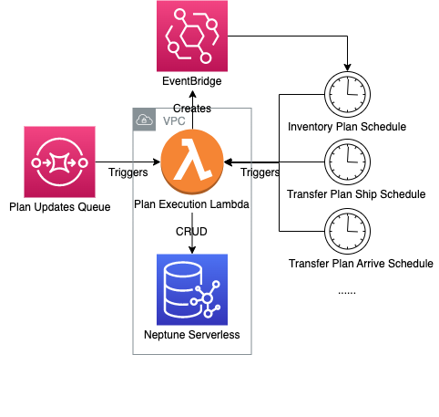

## Table of Content

-   [Plan Execution Overview](#plan-execution-overview)
-   [Plan Execution Workflow](#plan-execution-workflow)
-   [Architecture Diagram](#architecture-diagram)
-   [Build and Test](#build-and-test)

# Plan Execution Overview

Plan execution is a backend service which takes care of the execution of inventory and transfer plans. For new created or 
recent updated plans, the plan execution lambda will register "timer"s for each plan based on it's preferred timestamp. 
Once the pre-registered timer is fired, this lambda will execute lambda by adding or subtracting the amount value for each 
target item. Also a new item record will be generated in order to track historical data. All of those CRUD operations will
be persisted back to the neptune db.

# Plan Execution Workflow

Plan execution is built on top of [AWS Lambda](https://aws.amazon.com/lambda/) which handles 2 types of triggers: 
SQS event and EventBridge customized scheduler input.

Once an existing plan is updated or a new plan come through, a change log will be emitted out to neptune stream and then 
forwarded by stream poller to SQS. Plan execution will perform a query upon the neptune db given the plan's id, in order 
to fetch a full list of properties which will be used for generating the EventBridge customized scheduler input. 

A recurring EventBridge scheduler or a pair of one-time EventBridge scheduler will be generated as part of this execution:
- A recurring EventBridge scheduler will be created for inventory plan. Scheduler details:
    - Name: id of the plan vertex
    - ScheduleExpression: [cron-based schedules](https://docs.aws.amazon.com/scheduler/latest/UserGuide/schedule-types.html?icmpid=docs_console_unmapped#cron-based), for example: `cron(15 10 ? * 6L 2022-2023)`
    - StartDate: start date on pre-defined plan
    - EndDate: end date on pre-defined plan
    - Input:             
        - Id: id of the vertex 
        - Type: inventory plan type: manufacturing / sales
        - DailyRate: the amount the inventory changes by
    
- A pair of one-time EventBridge scheduler will be generated for transfer plan. Given EventBridge doesn't support invoking 
scheduler multiple times with different timestamps, we have to create ship and arrive schedules separately. Scheduler details:
    - Name: id of the plan vertex plus scheduler type: ship / arrive
    - ScheduleExpression: [at expression](https://docs.aws.amazon.com/scheduler/latest/UserGuide/schedule-types.html?icmpid=docs_console_unmapped#cron-based) follows syntax: `at(yyyy-mm-ddThh:mm:ss)`
    - Input:             
        - Id: id of the inventory plan: manufacturing / sales
        - SourceInventoryId: the source inventory from which inventory will be transferred
        - DestinationInventoryId: the destination inventory to which inventory will be transferred
        - Amount: the amount of inventory being transferred


Once a pre-registered timer is fired, Plan execution will be triggered by EventBridge Scheduler with one of the 2 customized
input shown above. Given the incoming input type, a recurring inventory plan or one-time transfer plan will be executed:
- Inventory Plan input:
    - Query the neptune db to obtain an item vertex
    - Update the item vertex by:
        - Change `dateEntered` to current lambda system timestamp
        - Add `dailyRat`" to `amount`
    - Create a new item record:
        - `dateFrom`: use the value of `dateEntered` field before update
        - `dateTo`: use the value of `dateEntered` field after update
        - `amount`: use the value of `amount` field before update

- Transfer Plan input:
    - Query the neptune db to obtain  item vertices (there should be 2)
    - Update the item vertices by:
        - Change `dateEntered` to current lambda system timestamp.
        - For `takes` edge item node: subtract `transferAmount" from `amount`
        - For `gives` edge item node: add `transferAmount` to `amount`
    - Create new item records (there should be 2):
        - `dateFrom`: use the value of `dateEntered` field before update.
        - `dateTo`: use the value of "`ateEntered` field after update.
        - `amount`: use the value of `amount` field before update.

# Architecture Diagram



# Build and Test
- Change the current working directory

```
cd source/app/plan-execution
```

- Build project and run eslint check
```
npm run build
npx eslint **/src/*.ts
```

- Run unit tests
```
npm run test
```
